<h2>Spring Security </h2>

<h3>- InMemory Authentication method :</h3>
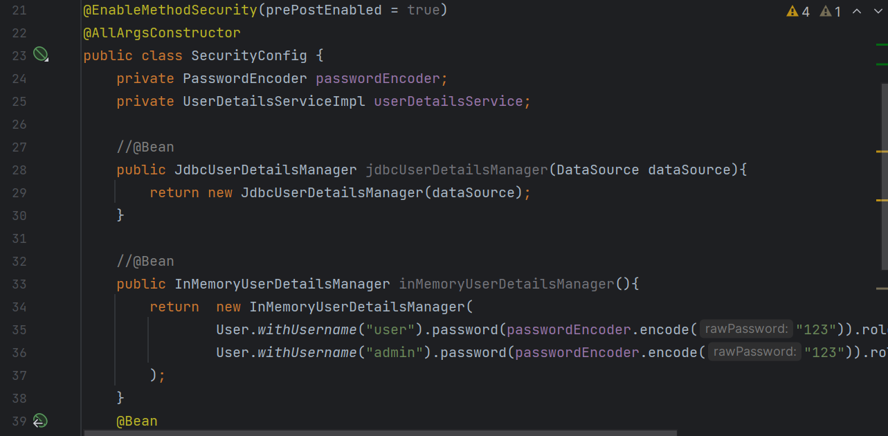
<h4>Protection des methodes avec l'annotation "@PreAuthorize".</h4>
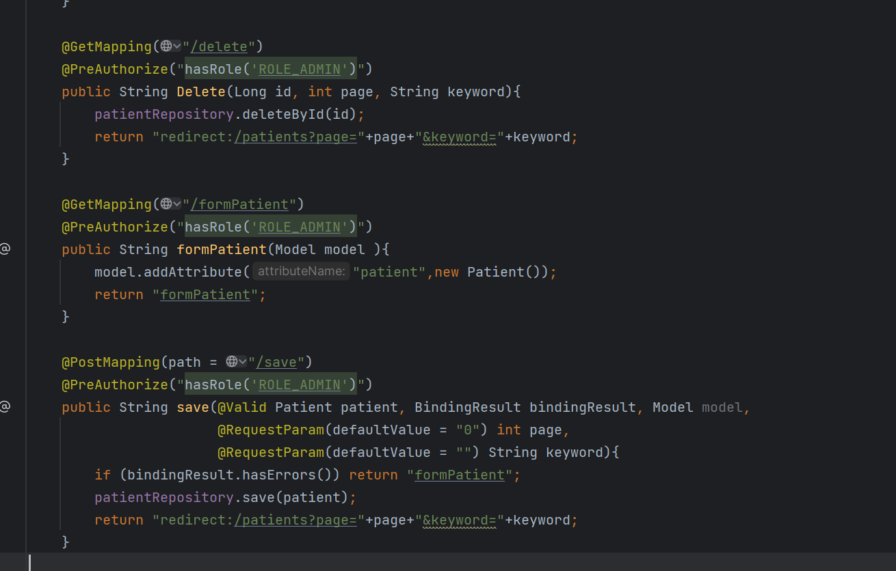

<h3>- JDBC Authentication method :</h3>
<h4>JDBC Bean permettant la connexion avec la base de données via l'objet dataSource.</h4>
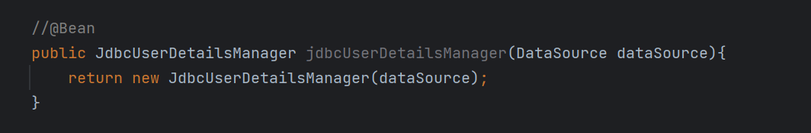
<h4>La Création des users avec leurs roles au démarrage de l'application via le JDBC Bean crée.</h4>
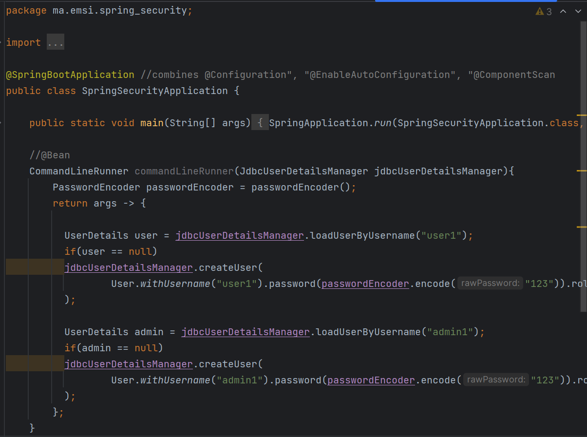
<h4>Le Fichier schema.sql contenant les requêttes permettant la création des tables users et authorities et un index sur leurs colonnes.</h4>

<h3>- UserDetails Authentication method :</h3>
<h4>L'entité User :</h4>
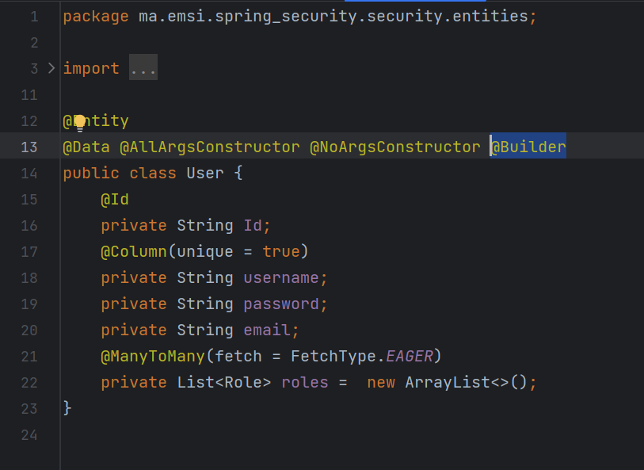
<h4>L'entité Role :</h4>
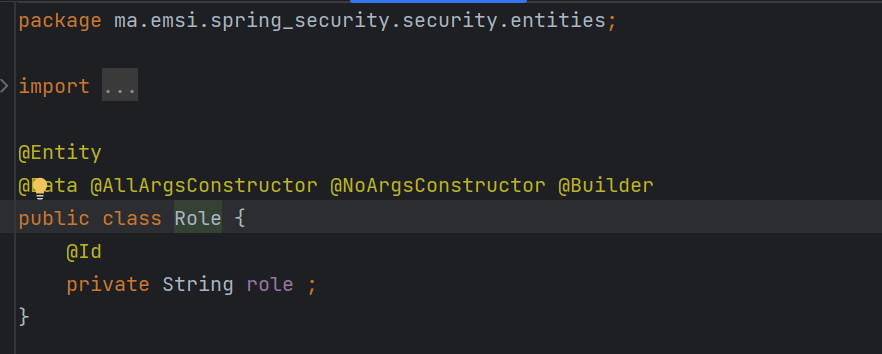

<h4>L'interface UserRepository :</h4>
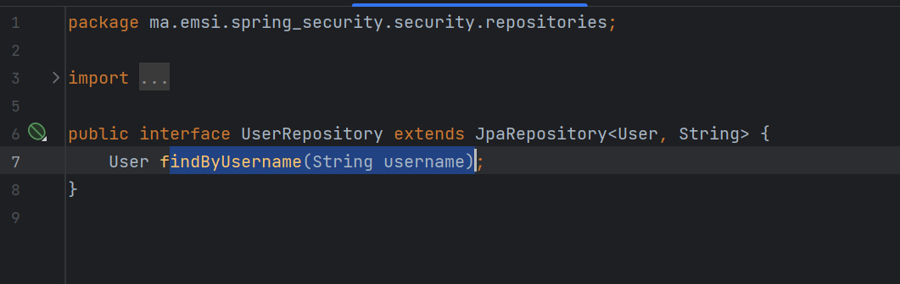
<h4>L'interface RoleRepository :</h4>
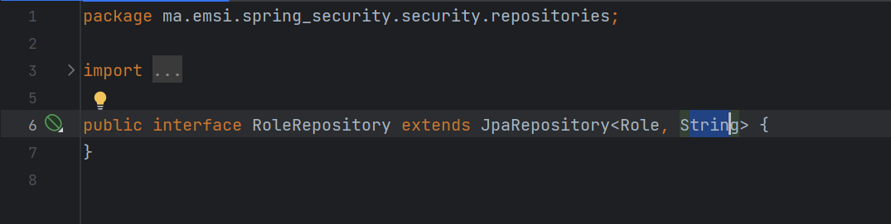

<h4>L'interface UserService :</h4>
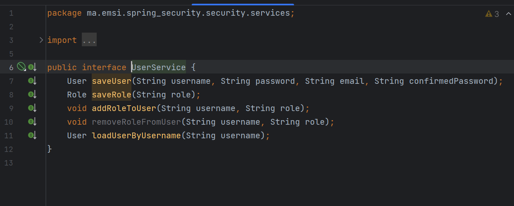
<h4>L'implémentation de l'interface UserService :</h4>

<h4>La Création des users et des roles et affecter les roles au users.</h4>
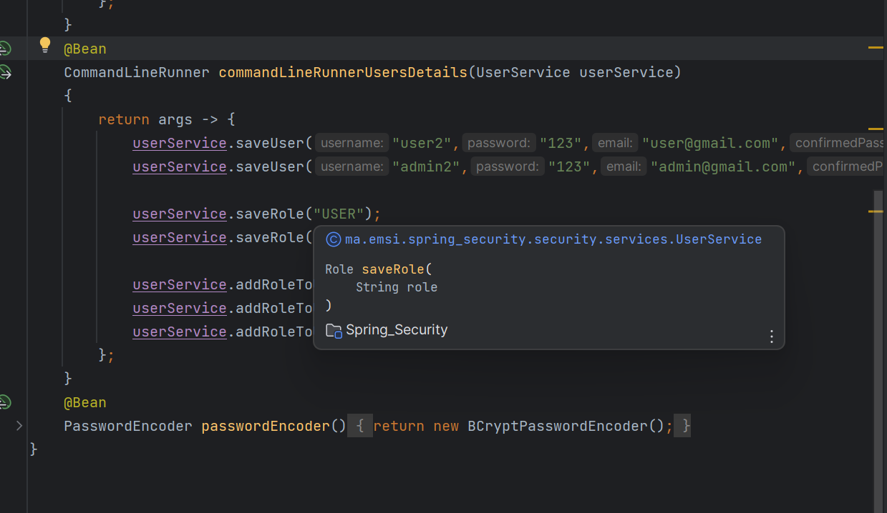

N.B: Il faut pas les recrée afin d'éviter une des exception définies dans les méthodes.

<h4>L'implémentation de l'interface UserDetailsService :</h4>
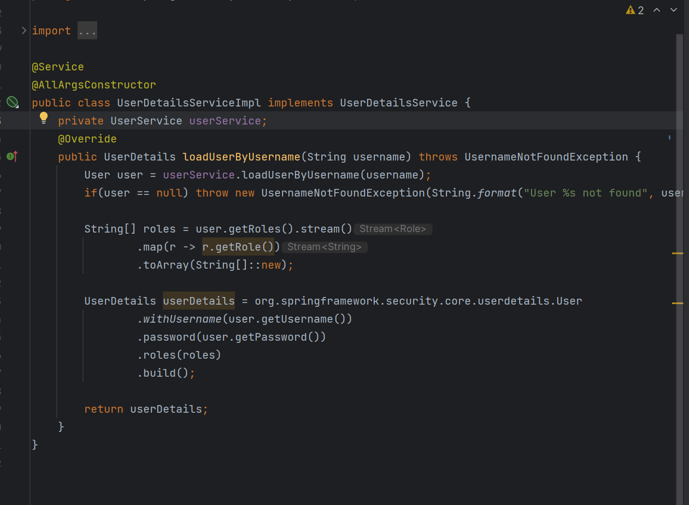
<h4>Configuration de la methode UserDetails par un objet de type UserDetailServiceImpl :</h4>
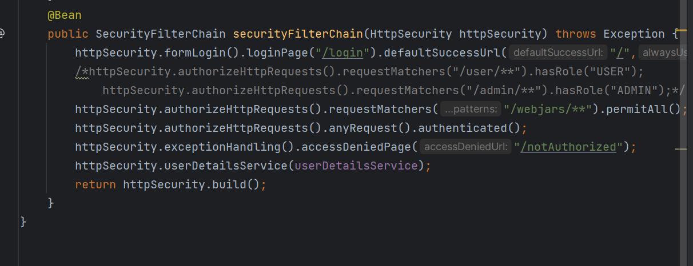
